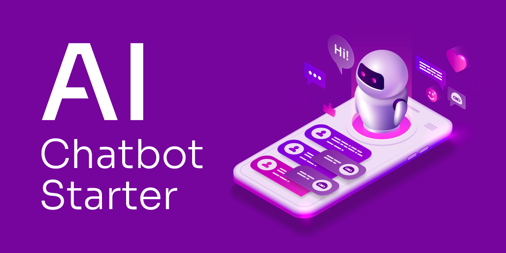

# AI Chatbot Starter

This AI Chatbot Starter is designed to help developers find the information they need to debug their issues.

It should answer customer questions about the products or services specified.

## Getting Started

1. Clone the repository
2. Make sure you have Python 3.9+ installed
3. `pip3 install -r requirements.txt` to install the required packages
4. Obtain your OpenAI API Key from the OpenAI Settings page
5. Create a `.env` file & add the required information. Add the OpenAI Key from Step 4 as the value of `OPENAI_API_KEY`. The Astra and OpenAI env variables are required, while the others are only needed if the respective integrations are enabled.
6. Update the `config.yml` file to the company-specific parameters required. For an example of how this can look, take a look at `example_datastax_config.yml`.

### Embedding documentation into a table

Documentation (provided as a list of web urls in the `config.yml`) can be ingested into your Astra DB Collection using the following two commands:

1. `PYTHONPATH=. python data/scrape_site.py`
2. `PYTHONPATH=. python data/compile_documents.py`

### Running the full app

1. Ensure you're in the `ai-chatbot-starter` directory
2. Use `uvicorn app:app --host 0.0.0.0 --port 5555 --reload` to run the app
3. You can test an example query by running `python scripts/call_assistant.py "<your_query_here>"`

